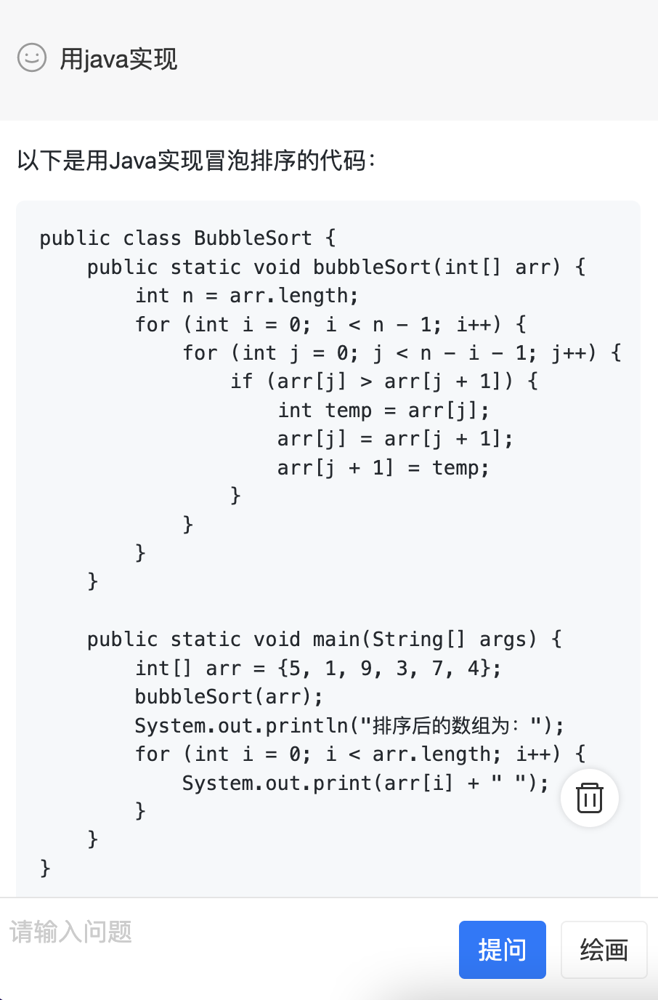

# chatGPT网页自部署版

> 2023.3.2更新，支持AI绘画

## 安装

> 使用docker-compose部署，请先安装docker-compose

```bash
# 克隆
git clone https://github.com/hyy22/chatgpt_webapp
# 切换目录
cd chatgpt_webapp
# 修改docker-compose配置，主要填写OPENAI_KEY是openAI的key，在https://platform.openai.com/account/api-keys获取
# 部署
docker-compose up -d
# 部署完成即可通过http://localhost:18080访问
```

## 截图




## 说明

前端采用react+antd-mobile+sse编写

服务端采用python+flask编写

chatGPT库采用[https://github.com/acheong08/ChatGPT](https://github.com/acheong08/ChatGPT)

## 问题汇总

**有时候无法拿到chatGPT的回复**

猜测可能是网络问题，或者chatGPT官方鉴权失败导致，暂时没有好的解决方案。目前处理方法是报错，稍后再试，有好的方案欢迎pr
