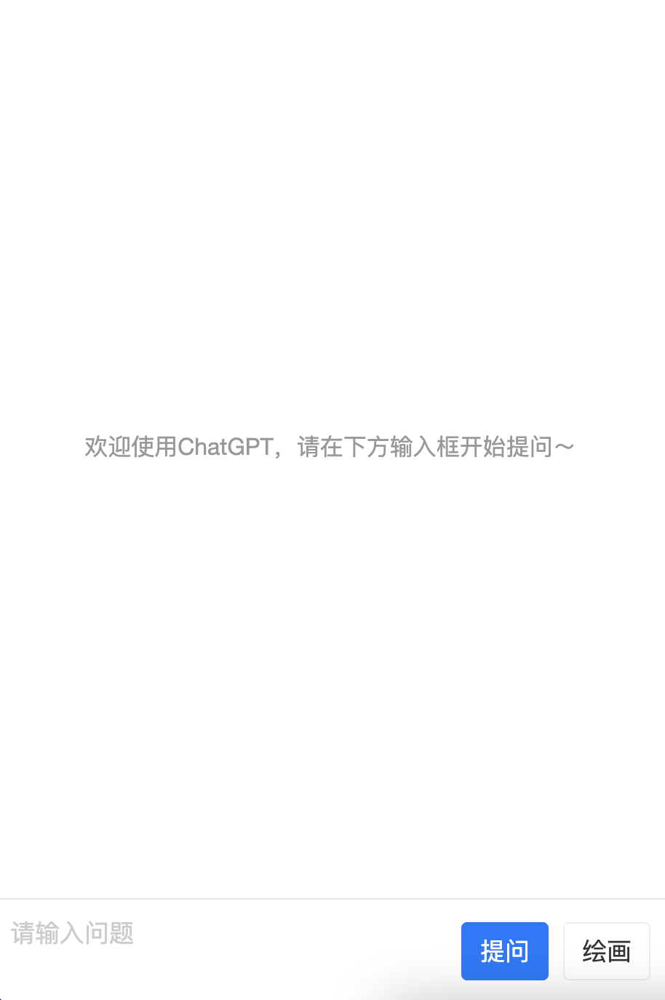

# chatGPT网页自部署版

> 2023.3.9更新，支持选择特定回复进行再次提问

> 2023.3.6更新，更新ChatApi模型gpt-3.5-turbo，如果不想使用chatgpt3.5 Api，可以使用dev1分支部署

> 2023.3.2更新，支持AI绘画

## 安装

> 使用docker-compose部署，请先安装docker-compose

```bash
# 克隆
git clone https://github.com/hyy22/chatgpt_webapp
# 切换目录
cd chatgpt_webapp
# 修改docker-compose配置，主要填写OPENAI_KEY是openAI的key，在https://platform.openai.com/account/api-keys获取
# 部署
docker-compose up -d
# 部署完成即可通过http://localhost:18080访问
```

## 截图




## 说明

前端采用react+antd-mobile+sse编写

服务端采用python+flask编写


## 问题汇总

**有时可能会有token超出的问题**

`gpt-3.5-turbo` api传参需要传之前对话的`messages`才能理解上下文，而传参和回复都是需要消耗token的，最大token限制为4096，超出就会报错。现在策略是客户端默认只传递最近两次对话数据，并对字数做了限制，如果需要精确进行上下文对话，可以点击问题前面的😊，勾选后会关联会话场景。

## 体验


扫码关注订阅号，发送关键词`chatgpt`进行体验
